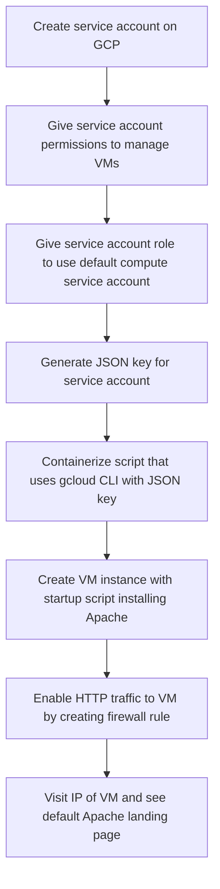
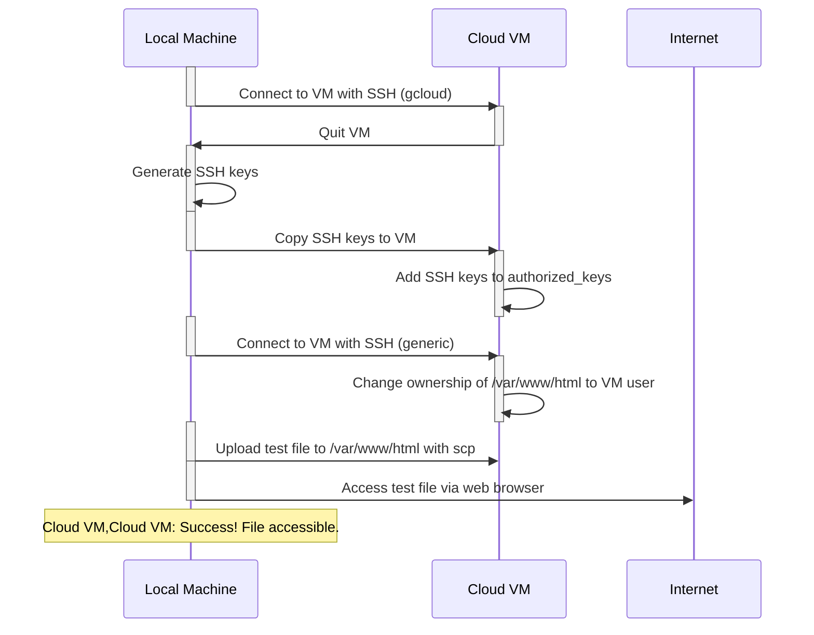
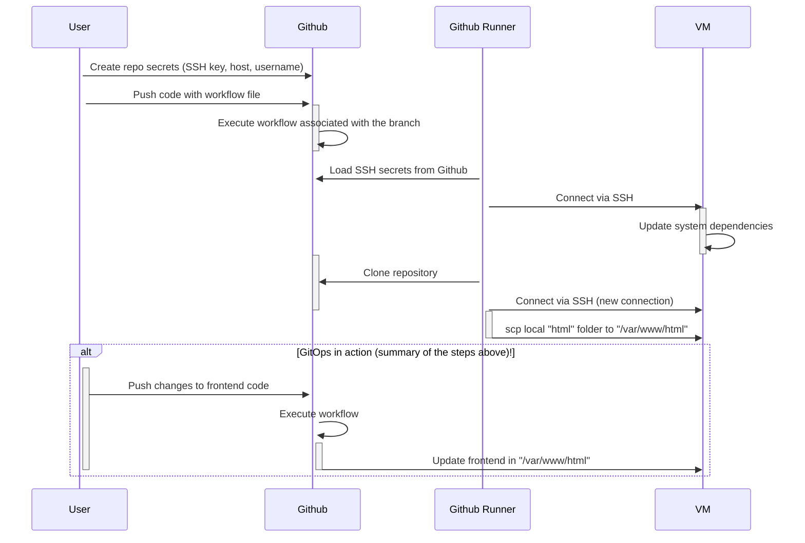
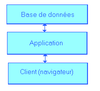

# SERFA GCP TP3: VMs and `gcloud` scripting

## scripting creation of VM's with `gcloud`

- enable Compute Engine API
- install `gcloud` CLI and configure it
- run `gcloud` to create an instance of a VM (replace with the correct values) =>

```bash
gcloud compute instances create test-server \
    --project=PROJECT \
    --zone=ZONE \
    --machine-type=e2-standard-2 \
    --network-interface=network-tier=PREMIUM,stack-type=IPV4_ONLY,subnet=default \
    --metadata=startup-script=\ \
\#\!\ /bin/bash$'\n'\ apt\ update$'\n'\ apt\ -y\ install\ apache2$'\n'\ cat\ \<\<EOF\ \>\ /var/www/html/index.html$'\n'\ \<html\>\<body\>\<p\>Linux\ startup\ script\ added\ directly.\</p\>\</body\>\</html\>$'\n'\ EOF \
    --no-restart-on-failure \
    --provisioning-model=STANDARD \
    --service-account=DEFAULT_COMPUTE_SERVICE ACCOUNT \
    --scopes=https://www.googleapis.com/auth/devstorage.read_only,https://www.googleapis.com/auth/logging.write,https://www.googleapis.com/auth/monitoring.write,https://www.googleapis.com/auth/servicecontrol,https://www.googleapis.com/auth/service.management.readonly,https://www.googleapis.com/auth/trace.append \
    --tags=http-server \
    --create-disk=auto-delete=yes,boot=yes,device-name=test-server,image=projects/debian-cloud/global/images/debian-12-bookworm-v20240213,mode=rw,size=10,type=projects/PROJECT/zones/ZONE/diskTypes/pd-balanced \
    --no-shielded-secure-boot \
    --shielded-vtpm \
    --shielded-integrity-monitoring \
    --labels=goog-ec-src=vm_add-gcloud \
    --reservation-affinity=any
```

- you can find the IP of your VM with => `gcloud compute instances describe test-server --format='get(networkInterfaces[0].accessConfigs[0].natIP)'`

- enable HTTP traffic => 

`gcloud compute firewall-rules create allow-http --direction=INGRESS --priority=1000 --network=default --action=ALLOW --rules=tcp:80 --source-ranges=0.0.0.0/0`

... this command works because you have tagged your VM with `http-server` tag.

- now delete your VM with: `gcloud compute instances delete test-server --zone=ZONE`

- ok, let's create a simple script to automate this and save it as [`gcp-vm.py`](./gcp-vm.py), let's make it take the parameters that can vary:

    - a `.env` file with `DEFAULT_COMPUTE_SERVICE_ACCOUNT`, `GCP_PROJECT`, and `GCP_ZONE` variables
    - a parameter for the name of the VM, to pass to the script => `python3 gcp-vm.py create test-server`

## resources

- https://cloud.google.com/sdk/docs/scripting-gcloud
- https://cloud.google.com/blog/products/management-tools/scripting-with-gcloud-a-beginners-guide-to-automating-gcp-tasks
- there is a `bash.Dockerfile` image at the root of the repo, this is to test bash commands on Ubuntu, to use it

    - `docker build -f bash.Dockerfile -t bash .`
    - `docker run bash` => this will create a container and block your terminal
    - open a shell inside the container from another terminal => `docker exec -it CONTAINER_NAME /bin/bash`

## script everything with Docker

- script this process inside Docker:

    1. install `gcloud` CLI
    2. authenticate with your project (maybe with a key?)

    

    3. create a VM with a startup script
    4. enable HTTP traffic
    5. ping the VM to check if it's up
    6. delete the VM

... the goal is to do all these steps with a simple `docker run IMAGE...` command.

`docker build --build-arg PROJECT_NAME=markets-agent --build-arg SERVICE_ACCOUNT_EMAIL=vms-sa@markets-agent.iam.gserviceaccount.com -t gcp-vm .`

But before moving on with the next step, here is a diagram showing this process:



## CI/CD deployment

Most of the Apache servers host your website files under `/var/www`.

Now, with a VM that is up and not being deleted, we want to update our application in an automated way, for that we need to:

- connect via SSH to the server
- copy the source code to the server inside the correct folder
- if the Apache configuration changes, restart the server as a `sudo` user without interactivity

First, we need to try the whole process manually:

### manual steps

#### create the SSH keys that allow you to connect to the VM

`gcloud compute ssh VM_NAME --zone=ZONE` to:

- create SSH keys using gcloud
- this will create the keys, the first time you connect to the machine, and store them in the default location `~/.ssh` (on a Debian distro) for SSH
- you can now exit the VM

#### impersonate the SSH user that will connect to the VM

In this step, what we want is to be able to not use `gcloud` to get inside the VM. Why don't we want to use `gcloud`? it's because we want the simplest and the most generic way to connect to our machine without having to install additional dependencies (such as `gcloud`) in our CI/CD pipeline.

For this, we'll register our newly created keys with the `ssh-agent` on our local machine like so => `eval "$(ssh-agent -s)" && ssh-add google_compute_engine`.

Here, `google_compute_engine` is the name of the private key file that `gcloud` created for us.

#### try to connect to the VM without `gcloud`

`ssh USER@IP`, this should allow you to access the VM.

If you don't know or remember the `USER` part, just use `gcloud` again to connect to the VM and check the user name once inside it.

#### try copying files inside the VM

`scp test.txt USER@IP:/var/www/html` => this copies the the file inside the VM's `/var/www/html` folder.

The first time you'll run this, you will encounter a permissions issue: it's because your VM user doesn't own the folder in which Apache stores the website files. You can verify this by running `ls -l /var/www` inside the VM. To be able to copy files within the VM, you'll need, inside the VM, to: `sudo chown USER -R /var/www/html`.

Now if you copy again the file and go to `http://IP/test.txt` you should see the content of the file.

Here is a diagram showing all the manual steps:



Ok, now let's update our site with a pipeline !

### automate the process

Now we are ready to do all of the above via GitHub Actions.

The step `sudo chown USER -R /var/www/html` needs to be run only once, so no need to add that in the pipeline as well.

What do we need to implement continuous deployment?

1. write the pipeline in `.github/workflows/cicd.yml`

```yaml
name: cicd

on:
  push:
      branches: [main]

jobs:

  gcp-vm-sysadmin:
    name: gcp-vm-sysadmin
    runs-on: ubuntu-latest
    steps:
    - name: sysadmin ops on GCP VM
      uses: appleboy/ssh-action@v1.0.1
      env:
        DEBIAN_FRONTEND: "noninteractive"
      with:
        # should be the IP address of your VM
        host: ${{ secrets.SSH_HOST }}
        # should be the SSH key that you used to connect to the VM
        key: ${{ secrets.SSH_PRIV_KEY }}
        port: 22
        username: ${{ secrets.SSH_USERNAME }}
        script_stop: true
        # all the commands you see after the `|` will be executed in the remote machine
        script: |
            sudo apt-get update && sudo apt-get upgrade -y
            cd /var/www/html
            touch test.txt
            echo "I WAS UPDATED BY THE CICD PIPELINE" > test.txt
```

This pipeline basically says:

- "connect to the machine with IP SSH_HOT, using the SSH_PRIV_KEY and the SSH_USERNAME"
- "run the commands specified after the | character in the remote machine"
- "create a file within the machine so we can check that the site was updated"

2. create the relevant GitHub repo secrets for `SSH_HOST`, `SSH_PRIV_KEY`, and `SSH_USERNAME`; for the private key, just copy-paste its content in the value of the secret.
3. make a change to `echo "I WAS UPDATED BY THE CICD PIPELINE" > test.txt`
4. push the change to the `main` branch and wait for the action to complete
5. check the VM's IP and see if the file was updated at `/test.txt` URL


#### deploy like in 2024

- go inside the VM and delete the file `test.txt` (delete its creation inside the pipeline as well)
- add the new GitHub Actions job that copies the contents of the `html` folder within the VM's `/var/www/html` folder
- change the contents of the `html` folder in your repo
- check that the changes have been reflected on the Internet after the action has run

Here is the diagram showing the process =>



## spec out the app's features: what does the app' do?

It's an app' to manage tickets.

- a `ticket` is a the description of a problem or a task
- a ticket can be opened, closed
- a ticket can have comments
- a ticket has a resolution
- CRUD (Create Read Update Delete) tickets
- CRUD users
- there are permissions in the application:
  - CRUD-related permissions
  - close a ticket
  - comment on a ticket
  - open a ticket
- these permissions are distributed among roles:
  - admin
  - requester
  - support

## spec out how we are going to do this technically

### frontend

What views/pages do we need ?

- login page
- home => lists all tickets
  - ability to delete a ticket
  - priority of tickets
  - status labels of the tickets
  - ticket assignement button
- registration page
- single ticket page
  - ability to close the ticket
  - contains comments
  - delete button for the ticket
  - edit form for the ticket
  - field for resolution of ticket
  - label for ticket status
  - priority of tickets
  - ticket assignement button
- ticket creation page
- users admin page:
  - a user can be deleted
  - lists users
  - the role of a user can be changed
  - there is an explanation of each role

... the app' complexifies now, it's about time we use a project management tool !

#### homepage with list of tickets

1st [Gemini](https://gemini.google.com/app) prompt =>

```
You are a frontend developer. 
Please write the HTML code that display a list of tickets as a table.
Each ticket row has:

- ability to delete a ticket
- status labels of the tickets
- ticket assignement button
```

### the swag part

We have generated favicons and added them to our project.

### moving on to 3-tier architecture ?

Now we want to:

- display the list of tickets dynamically (from a database)
- restrict who can access the database directly => [3-tier architecture](https://fr.wikipedia.org/wiki/Architecture_trois_tiers)




... finally we don't do that and we use a simplified version of this architecture using a Firebase instance, which means we only have two tiers: the frontend and the database.

### initiate a Firebase project

- go to the Firebase and create your project attached to your GCP project
- copy the HTML snippet into your code (with the correct keys)
- verify that everything loads (Firebase + favicons) locally
- deploy online and verify

### now, let's us a Firebase realtime database

- we need to compile Javascript modular code so that the browser understands it
- we need an intermediary step to push the Firebase code to the browser => we are going to use for Node.JS for this
- we don't want to install Node.JS on our local machine, so we are going to use Docker for this
- we create a Docker image which runs forever
- we are going to do Node.JS operations inside the container
- with a volume, all our changes will be reflected in our repo

Try this out ! run the Node.JS Docker Compose service, create a file inside the container under the `/app` folder, see it in your local machine.

### becoming badass Javascript developers

1. `npm init` from the dockerized Node.JS Docker Compose service
2. this created a `package.json` file, which contains the list of all the JS dependencies (libraries) of our project
3. we 've installed `firebase` and `webpack` with `npm install` from within our Node container
  - `firebase` is the Node.JS version of the previous code we have put in our HTML
  - `webpack` is the library that will help us translate the Node.JS code into something the browser can understand

  ... these can be installed with `npm install firebase webpack webpack-cli`

4. we moved the Firebase code from the frontend folder `html` to the `src` folder: this is the code that will be compiled by Webpack
5. the guidelines of how to compile the code are specified in the `webpack.config.js` file + we've added a script to compile the in our `package.json` file

```json
"scripts": {
  "build": "webpack --mode=development"
}
```

... now we can run `npm run build` and see the bundled code appear in `html/javascript/firebase-bundle.js` !

6. we rebuilt our Docker app' image
7. we checked in the browser if the database error has disappeared, and it has !

### trying Firebase locally

- for testing, we want to write something to Firebase every time the page is loaded
- we use a development branch (we don't want to push the code online)
- we run `docker compose watch`:
  - we can access the `nodejs` container at all times
  - every time we run `npm run build`, the site is updated

... even if we follow the docs, we don't seem to be able to communicate with our Firebase instance, that's a shame, moving to another technology since the goal of selecting Firebase was to go faster.

What we keep from this experience is the Javascript bundling code and our development environment.


### chosing a SQL database

We select the default choice because of its popularity and its ease of use: PostgreSQL.

We need 2 more components:

- a web API
- a database

Let's start with the web API.

### starting to route traffic via a PHP index entrypoint

- we managed to route traffic to a PHP file using a PHP Apache conf locally using the `php:apache` Docker image
- now, if we want that to work on the remote, we need to install PHP in the VM in the CI/CD pipeline

### getting our tickets from our first API route

- now we have moved the tickets to a PHP API endpoint and we have set up routing in the `index.php` file